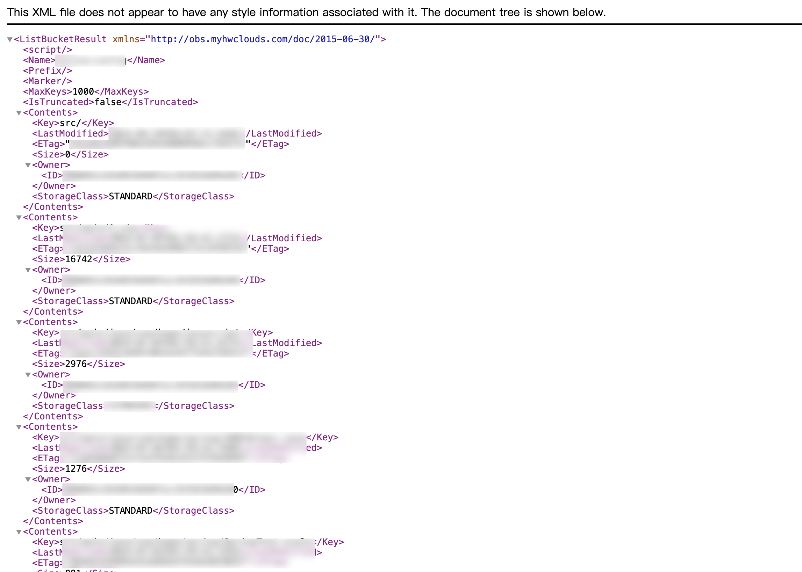
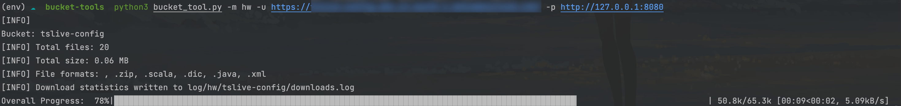
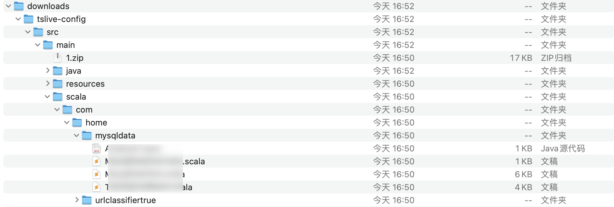
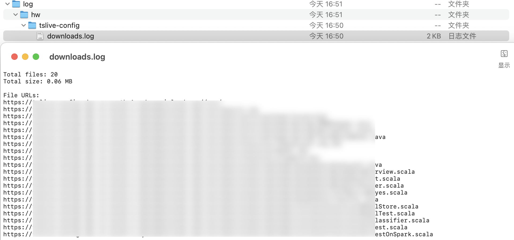

# 云存储桶遍历工具

用于遍历云存储桶文件，当云储存桶配置错误，就可以从中下载文件。提供一个命令行接口，用于指定存储桶 URL 和管理下载进度。


## 特性

- 支持多个云存储提供商：Amazon S3、华为 OBS、阿里云 OSS、腾讯 COS、Backblaze B2、DigitalOcean Spaces、Google Cloud Storage、IBM Cloud Object Storage、Microsoft Azure Blob Storage 和 Oracle Cloud Storage。
- 支持多线程下载，并提供进度跟踪。
- 将下载统计信息记录到日志文件中。
- 支持通过 HTTP/SOCKS5 代理进行网络请求。


## 安装

1. 克隆代码库：

```bash
git clone https://github.com/nu0l/bucket_tool.git
cd <repository-directory>
```

2. 安装所需的依赖包：

```bash
pip install -r requirements.txt
```


## 用法

您可以使用以下命令运行该工具：

```
python bucket_tool.py -m <module> -u <bucket-url> [-f <file-with-urls>] [-p <proxy>] [-t <threads>]
```


### 命令行参数

- `-m`, `--module`：指定云存储模块。选项包括：
  - `hw` 代表华为 OBS
  - `ali` 代表阿里云 OSS
  - `tx` 代表腾讯 COS
  - `s3` 代表 Amazon S3
  - `b2` 代表 Backblaze B2
  - `do` 代表 DigitalOcean Spaces
  - `gcs` 代表 Google Cloud Storage
  - `ibm` 代表 IBM Cloud Object Storage
  - `abs` 代表 Microsoft Azure Blob Storage
  - `oci` 代表 Oracle Cloud Storage
- `-u`, `--url`：指定单个存储桶 URL。
- `-f`, `--file`：指定包含多个存储桶 URL 的文件（每行一个 URL）。
- `-p`, `--proxy`：设置全局代理（例如 `http://127.0.0.1:8080`）。
- `-t`, `--threads`：使用的下载线程数（默认为 `3`）。


### 示例

以华为云为例：
**如果将存储桶设置为公共读或者公共读写就会导致Object遍历**



**从 华为云 OBS 存储桶下载文件：**

```
python bucket_tool.py -m hw -u https://xxx.xxx.com -p http://127.0.0.1:8080
```



下载的文件将按照目录顺序保存在`downlaods/`文件中。（保留原有目录结构）



**从包含多个存储桶 URL 的文件中下载文件：**

```
python bucket_tool.py -m ali -f oss-urls.txt -p http://127.0.0.1:8080
```


## 日志

下载统计信息将保存在 `log/<module>/<bucket-name>/downloads.log` 中。




## TODO

- 支持更多的存储桶遍历利用

- [x] 华为云OBS，已验证
- [x] 阿里云OSS，已验证
- [x] 腾讯云COS，已验证
- [ ]  Amazon S3，未验证有效性
- [ ] Backblaze B2，未验证有效性
- [ ] DigitalOcean Spaces，继承AWS3，未验证有效性
- [ ] Google Cloud Storage，未验证有效性
- [ ] IBM Cloud Object Storage，未验证有效性
- [ ] Microsoft Azure Blob Storage，未验证有效性
- [ ] Oracle Cloud Storage，继承AWS3，未验证有效性

*手上的信用卡不支持注册国外的云服务，欢迎使用过程中反馈国外的云服务模块是否运行正常*
